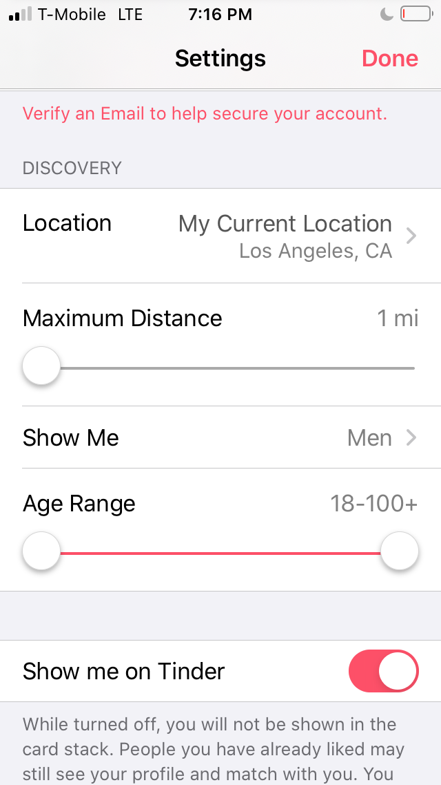

##Journal 2 - Is Tinder Worth Downloading ?

** Jozzel Esqueda 04/12/2020 **

Tinder is a "dating" app where you either swipe left (for people you do not like), or right(for people you do like).

As I'm swiping throught Tinder, I always get this secret admirer box pop up, and its really annoying and highly **ineffective** towards matching me with one of the four guys on the screen who I think are cure because it takes forever to see their photos, So 9/10 times I always skip this part.  

Under settings, I get to chose who shows up while I'm swiping, so I get to have an age range and a mile range. My age range goes from 18 to 100, but my mile range is only up to one mile. This feature is **memorable** because if I were to download another dating app, the first thing i would do is go to settings and see if I can manipulate who shows up on while I'm using the app.

However when I'm using Tinder, Guys who are thousands and thousands of miles away from me are showing up. This is **ineffective** because 10/10, I'm going to swipe left on this person. 
How am I supposed to meet with someone if theyre most likely in another country?  

